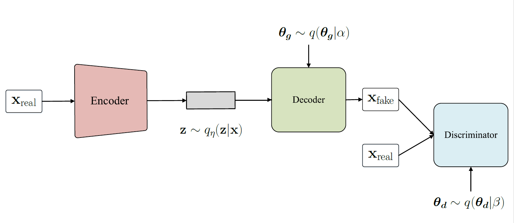
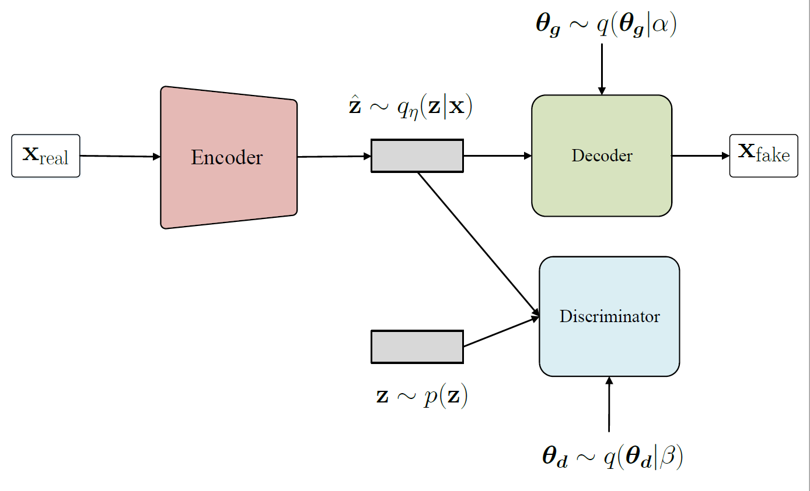

# Variational Bayesian GAN for MNIST Generation
In this repositor, we implement our proposed VBGAN and VBGAN with Wasserstein metric based on auto-encoder based generator and train the model with adversarial learning. Further, we extend the Jensen Shannon divergence between data distribution and generating distribution to geometric distance to make the model more robust and genearate better result

  
  

## Setting
- Framework:
    - Pytorch 0.4.0
- Hardware:
	- CPU: Intel Core i7-2600 @3.40 GHz
	- RAM: 20 GB DDR4-2400
	- GPU: GeForce GTX 980
